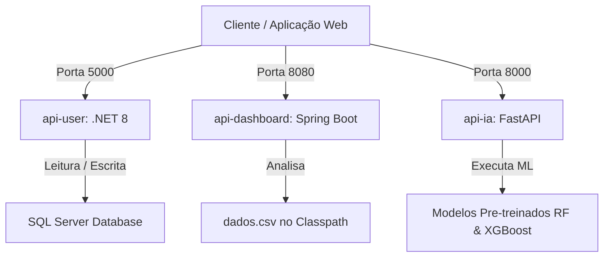

# Serena — Ecossistema de Backend

Bem-vindo ao repositório de backend do **Serena**, um sistema moderno baseado em microsserviços projetado para apoiar e proteger vítimas de violência doméstica. O Serena oferece gerenciamento seguro de usuários, análise de dados por meio de um dashboard interativo e inteligência preditiva para avaliar perfis de risco e identificar tipos prováveis de abuso.

O ecossistema é dividido em três microsserviços independentes desenvolvidos em diferentes linguagens para aproveitar o melhor de cada tecnologia para seu domínio específico (.NET para o CRUD de usuários corporativos, Java/Spring Boot para computações analíticas robustas e Python/FastAPI para inferência de Machine Learning).

---

## Treinamento dos Modelos de IA (Google Colab)

Os modelos de classificação de violência utilizados pela `api-ia` (Random Forest e XGBoost) foram desenvolvidos, analisados e treinados em um ambiente interativo Jupyter Notebook.

Você pode acessar o notebook do Google Colab com o pipeline completo de treinamento, engenharia de recursos (feature engineering) e validação dos modelos através do link abaixo:

👉 **[Google Colab — Treinamento dos Modelos Serena](https://colab.research.google.com/drive/1xXqxLDLlAcD2mPR_W17qlhY0kmJ8GYKN?usp=sharing)**

---

## Tabela de Conteúdos

1. [Treinamento dos Modelos de IA (Google Colab)](#treinamento-dos-modelos-de-ia-google-colab)
2. [Arquitetura do Sistema](#arquitetura-do-sistema)
3. [Tecnologias Utilizadas (Tech Stack)](#tecnologias-utilizadas-tech-stack)
4. [Estrutura de Diretórios do Repositório](#estrutura-de-diretórios-do-repositório)
5. [Pré-requisitos](#pré-requisitos)
6. [Como Começar (Setup Local)](#como-começar-setup-local)
   - [Opção 1: Docker Compose (Recomendado)](#opção-1-docker-compose-recomendado)
   - [Opção 2: Executando os Microsserviços Localmente](#opção-2-executando-os-microsserviços-localmente)
     - [1. Configurando o Banco de Dados (SQL Server)](#1-configurando-o-banco-de-dados-sql-server)
     - [2. Configurando a api-user (.NET 8)](#2-configurando-a-api-user-net-8)
     - [3. Configurando a api-dashboard (Java/Spring Boot)](#3-configurando-a-api-dashboard-javaspring-boot)
     - [4. Configurando a api-ia (FastAPI/Python)](#4-configurando-a-api-ia-fastapipython)
7. [Referência de Endpoints das APIs](#referência-de-endpoints-das-apis)
   - [API de Gerenciamento de Usuários (api-user)](#api-de-gerenciamento-de-usuários-api-user)
   - [API de Indicadores do Dashboard (api-dashboard)](#api-de-indicadores-do-dashboard-api-dashboard)
   - [API de Predição de IA (api-ia)](#api-de-predição-de-ia-api-ia)
8. [Modelagem e Esquema de Banco de Dados](#modelagem-e-esquema-de-banco-de-dados)
   - [Esquema do api-user (SQL Server)](#esquema-do-api-user-sql-server)
   - [Esquema do api-dashboard (Fonte CSV)](#esquema-do-api-dashboard-fonte-csv)
   - [Esquema de Aprendizado de Máquina do api-ia](#esquema-de-aprendizado-de-máquina-do-api-ia)
9. [Variáveis de Ambiente](#variáveis-de-ambiente)
10. [Solução de Problemas Comuns (Troubleshooting)](#solução-de-problemas-comuns-troubleshooting)
11. [Segurança e Diretrizes de Produção](#segurança-e-diretrizes-de-produção)

---

## Arquitetura do Sistema

O ecossistema é composto por três microsserviços que cooperam sob um modelo REST, orquestrados através de contêineres Docker:



- **api-user (`http://localhost:5000`)**: Gerencia a autenticação de usuários, criação de perfis e diretório de contatos de apoio. Utiliza o Entity Framework Core (EF Core) conectado ao Microsoft SQL Server.
- **api-dashboard (`http://localhost:8080`)**: Realiza consultas de agregação, estatísticas e métricas de violência a partir de um arquivo CSV volumoso contendo ocorrências históricas de violência doméstica.
- **api-ia (`http://localhost:8000`)**: Oferece previsões sobre o tipo de abuso (Física, Psicológica, Sexual, Moral, Patrimonial) com base em respostas enviadas a um formulário de avaliação de risco. Executa classificadores XGBoost e Random Forest serializados com joblib.

---

## Tecnologias Utilizadas (Tech Stack)

| Componente | Tecnologia | Versão | Função |
| :--- | :--- | :--- | :--- |
| **User API** | C#, .NET Web API | `8.0` | CRUD de usuários, login e gerenciamento de contatos de apoio |
| **Banco de Dados** | MS SQL Server | `2022-latest` | Armazenamento de usuários, endereços e números de emergência |
| **ORM** | Entity Framework Core | `8.0` | Mapeamento de objetos C# para o banco de dados e execução de migrations |
| **Dashboard API** | Java, Spring Boot | `17+` | Disponibiliza endpoints de estatísticas e indicadores |
| **Gerenciador de Build** | Apache Maven | `3.9+` | Gerenciamento de dependências e empacotamento do app Java |
| **Parser de Dados** | OpenCSV / Java Vanilla | - | Processamento, leitura e agregação dos registros contidos no CSV |
| **AI API** | Python, FastAPI | `3.12` | Endpoints assíncronos de alta performance para execução dos modelos |
| **Modelos de ML** | scikit-learn & XGBoost | `scikit-learn 1.6.1` <br> `xgboost 2.1.3` | Algoritmos de Machine Learning treinados para classificar violências |
| **Containerização** | Docker, Docker Compose | - | Orquestração local dos microsserviços e do banco de dados |

---

## Estrutura de Diretórios do Repositório

O repositório está organizado sob a pasta [serena-backend](file:///d:/GitHub/Serena-back/serena-backend), mantendo os serviços independentes e modulares:

```
d:/GitHub/Serena-back/
├── .agents/                      # Instruções e automações locais de agentes
├── .gitignore                    # Arquivos ignorados pelo Git no nível da raiz
├── README.md                     # Documentação principal do ecossistema (este arquivo)
└── serena-backend/               # Diretório raiz dos microsserviços
    ├── docker-compose.yml        # Configuração de orquestração multi-container
    ├── README.md                 # Visão geral original do backend
    ├── api-user/                 # Microsserviço de Usuários (.NET 8)
    │   ├── api-user.sln          # Arquivo de solução do .NET
    │   ├── Dockerfile            # Receita de build do container do api-user
    │   ├── Dominio/              # Definições de entidades (User, Endereco, Apoios)
    │   ├── ServiceUser/          # Regras de negócio, DTOs e perfis do AutoMapper
    │   ├── InfrastructureUser/   # Contexto do EF Core, Repositórios e Migrations
    │   └── api-user/             # Controllers HTTP e arquivo de inicialização (Program.cs)
    ├── api-dashboard/            # Microsserviço de Dashboard (Spring Boot)
    │   ├── Dockerfile            # Receita de build multi-stage para Java
    │   ├── pom.xml               # Configurações do Maven
    │   └── src/                  # Código-fonte Java e arquivos de recursos
    │       └── main/
    │           ├── java/         # Classes do Spring Boot (Controllers, Services, Repositories)
    │           └── resources/    # application.properties & arquivo dados.csv
    └── api-ia/                   # Microsserviço de IA (FastAPI + Python)
        ├── Dockerfile            # Receita de build para o servidor Uvicorn
        ├── requirements.txt      # Bibliotecas de Python e Machine Learning
        └── app/                  # Endpoints do FastAPI, carregador de modelos e esquemas Pydantic
            ├── models/           # Modelos de Machine Learning pré-treinados (.pkl)
            └── vectorizer.py     # Transforma respostas JSON em vetores binários de 51 features
```

---

## Pré-requisitos

Para rodar os projetos localmente, você precisará das seguintes ferramentas instaladas:

- [Docker Desktop](https://www.docker.com/products/docker-desktop/) (inclui Docker Compose)
- [.NET 8.0 SDK](https://dotnet.microsoft.com/download/dotnet/8.0) (Se for rodar o `api-user` fora do Docker)
- [Java Development Kit (JDK) 17](https://www.oracle.com/java/technologies/downloads/) (Se for rodar o `api-dashboard` fora do Docker)
- [Maven 3.9+](https://maven.apache.org/download.cgi) (Para compilação Java local)
- [Python 3.12](https://www.python.org/downloads/) (Se for rodar o `api-ia` fora do Docker)

---

## Como Começar (Setup Local)

### Opção 1: Docker Compose (Recomendado)

O Docker Compose sobe automaticamente todos os microsserviços junto com o banco de dados SQL Server, realiza os builds necessários, executa as migrations e configura a rede entre os serviços com um único comando.

Execute a partir da pasta [serena-backend](file:///d:/GitHub/Serena-back/serena-backend):

```bash
cd serena-backend
docker compose up --build
```

#### O que este comando realiza:
1. Baixa e inicializa a imagem do **MS SQL Server**.
2. Aguarda até que o banco de dados esteja pronto para receber conexões (healthcheck).
3. Constrói o container da `api-user`, roda as migrations automáticas para gerar as tabelas e inicia o serviço.
4. Constrói o container da `api-dashboard`, lendo o arquivo `dados.csv`.
5. Constrói o container da `api-ia`, carregando os arquivos classificadores `.pkl`.

#### Acessando os Serviços:
Com os contêineres ativos, os seguintes endpoints estarão disponíveis:
- **api-user (Documentação Swagger)**: [http://localhost:5000/swagger/index.html](http://localhost:5000/swagger/index.html)
- **api-dashboard (Total de registros)**: [http://localhost:8080/dashboard/total](http://localhost:8080/dashboard/total)
- **api-ia (Documentação Interativa OpenAPI)**: [http://localhost:8000/docs](http://localhost:8000/docs)

Para interromper e limpar os recursos criados (incluindo volumes persistentes do banco):
```bash
docker compose down -v
```

---

### Opção 2: Executando os Microsserviços Localmente

Se preferir executar e depurar os serviços de forma independente em sua máquina (sem Docker para os microsserviços):

#### 1. Configurando o Banco de Dados (SQL Server)
A `api-user` necessita de uma instância de SQL Server ativa. Você pode subir apenas o banco de dados via Docker:

```bash
cd serena-backend
docker compose up -d sqlserver
```

*(Ou utilize uma instância local de SQL Server instalada no seu Windows/Linux).*

#### 2. Configurando a api-user (.NET 8)

Navegue até a pasta da API de usuários, configure a variável de ambiente com a string de conexão e execute o projeto:

```bash
cd serena-backend/api-user

# No Linux / macOS
export ConnectionStrings__DefaultConnection="Server=localhost,1433;Database=User-API;User Id=sa;Password=Your_strong_Pass123;TrustServerCertificate=True;MultipleActiveResultSets=true"

# No Windows (Prompt de Comando - CMD)
set ConnectionStrings__DefaultConnection=Server=localhost,1433;Database=User-API;User Id=sa;Password=Your_strong_Pass123;TrustServerCertificate=True;MultipleActiveResultSets=true

# No Windows (PowerShell)
$env:ConnectionStrings__DefaultConnection="Server=localhost,1433;Database=User-API;User Id=sa;Password=Your_strong_Pass123;TrustServerCertificate=True;MultipleActiveResultSets=true"

# Executar o projeto
dotnet run --project api-user/api-user.csproj
```

O banco será criado ou atualizado automaticamente. Acesse o Swagger em [http://localhost:5000/swagger](http://localhost:5000/swagger).

#### 3. Configurando a api-dashboard (Java/Spring Boot)

Com o JDK 17 e Maven configurados em seu PATH, execute:

```bash
cd serena-backend/api-dashboard
mvn spring-boot:run
```

A API estará de pé na porta `8080`. Você pode testar os endpoints através do navegador, por exemplo: [http://localhost:8080/dashboard/total](http://localhost:8080/dashboard/total).

#### 4. Configurando a api-ia (FastAPI/Python)

Recomenda-se criar um ambiente virtual (Virtualenv) para isolar as dependências do Python:

```bash
cd serena-backend/api-ia

# Criar e ativar o ambiente virtual:
# No Linux / macOS:
python -m venv .venv
source .venv/bin/activate

# No Windows (CMD):
python -m venv .venv
.venv\Scripts\activate.bat

# No Windows (PowerShell):
python -m venv .venv
.venv\Scripts\Activate.ps1

# Instalar as dependências
pip install -r requirements.txt

# Iniciar o servidor FastAPI local
uvicorn app.main:app --reload --port 8000
```

Acesse a página de testes OpenAPI em [http://localhost:8000/docs](http://localhost:8000/docs).

---

## Referência de Endpoints das APIs

### API de Gerenciamento de Usuários (api-user)

URL Base: `http://localhost:5000/api/user`

| Método | Endpoint | Request Body | Descrição |
| :--- | :--- | :--- | :--- |
| **POST** | `/` | `UserCreateDto` | Cadastra um novo usuário no sistema. Valida duplicidade de e-mail/CPF/RG. Retorna `201 Created` ou `409 Conflict`. |
| **GET** | `/{id}` | - | Retorna os dados do usuário com o **CPF mascarado** por questões de privacidade. |
| **GET** | `/internal/{id}` | - | **Uso Interno**: Retorna dados completos contendo o **CPF puro (sem máscara)** para integrações seguras. |
| **PUT** | `/{id}` | `UserUpdateDto` | Atualiza dados cadastrais (endereço, telefone, etc.). |
| **DELETE** | `/{id}` | - | Remove permanentemente o registro do usuário. |
| **POST** | `/login` | `UserLoginDto` | Valida credenciais comparando hashes de senha em Base64. Retorna dados do usuário autenticado. |
| **POST** | `/reset-password` | `UserResetPasswordDto`| Permite a redefinição de senha de um usuário via e-mail. |

---

### API de Indicadores do Dashboard (api-dashboard)

URL Base: `http://localhost:8080/dashboard`

| Método | Endpoint | Tipo de Retorno | Descrição |
| :--- | :--- | :--- | :--- |
| **GET** | `/total` | `Integer` | Retorna o total de ocorrências de violência registradas na base CSV. |
| **GET** | `/municipios` | `Map<String, Long>` | Retorna um dicionário contendo o número total de casos agrupados por município. |
| **GET** | `/violencia-fisica` | `Map<String, Long>` | Retorna a contagem de agressões físicas ocorridas em cada município. |
| **GET** | `/violencia-por-ano` | `Map<Integer, Map<String, Long>>`| Retorna os tipos de violência identificados ano a ano. |
| **GET** | `/casos-por-idade` | `Map<String, Long>` | Agrupa ocorrências por faixa etária das vítimas. |
| **GET** | `/casos-por-hora` | `Map<Integer, Long>` | Exibe o volume de ocorrências de violência doméstica em cada hora do dia. |

---

### API de Predição de IA (api-ia)

URL Base: `http://localhost:8000/ia`

| Método | Endpoint | Request Body | Descrição |
| :--- | :--- | :--- | :--- |
| **GET** | `/health` | - | Retorna o status da API, modelos de ML ativos (`rf`, `xgb`) e tamanho das features. |
| **GET** | `/features` | - | Retorna a lista detalhada das 51 features aceitas e os rótulos de classe possíveis. |
| **POST** | `/prever` | `QuestionarioInput` | **Endpoint Principal**: Recebe as respostas do formulário de risco, vetoriza os dados e prevê o tipo provável de violência utilizando o classificador selecionado. |
| **POST** | `/prever-vetor` | `VetorInput` | Recebe um mapa binário `{feature: 0/1}` pré-vetorizado para inferência imediata. |

#### Exemplo de Requisição (`POST /ia/prever`)

```json
{
  "q1": "sim",
  "q2": "tiro",
  "q21": "soco",
  "q4": "ciume_controle",
  "q3_sexual": true,
  "q11_arma": true,
  "q19_cohabita": true,
  "q20_dependencia": true,
  "rel_afetiva": "Companheiro(a)",
  "rel_domiciliar": "Pessoa que reside no mesmo lar",
  "modelo": "xgb"
}
```

#### Resposta:

```json
{
  "modelo": "xgb",
  "classe_prevista": "Sexual",
  "confianca": 0.9963,
  "probabilidades": {
    "Física": 0.003,
    "Moral": 0.0003,
    "Patrimonial": 0.0003,
    "Psicológica": 0.0001,
    "Sexual": 0.9963
  }
}
```

---

## Modelagem e Esquema de Banco de Dados

### Esquema do api-user (SQL Server)

O mapeamento objeto-relacional estruturado pelo EF Core define as seguintes tabelas e relacionamentos:

```
   +------------------+             +--------------------+
   |     Endereco     |             |        User        |
   +------------------+             +--------------------+
   | PK  Id           | <---1:1---> | PK  Id             |
   | FK  UserId       |             |     Name           |
   |     Rua          |             |     Email          |
   |     Numero       |             |     PasswordHash   |
   |     Bairro       |             |     Cpf            |
   |     Cidade       |             |     Rg             |
   |     Estado       |             |     Telefone       |
   +------------------+             |     DataNascimento |
                                    +--------------------+
                                               ^
                                               | 1:N
                                               v
                                    +--------------------+
                                    |      Apoios        |
                                    +--------------------+
                                    | PK  Id             |
                                    | FK  UserId         |
                                    |     Nome           |
                                    |     Telefone       |
                                    +--------------------+
```

- **User**: Centraliza as informações do usuário. Possui um relacionamento 1 para 1 obrigatório com a tabela `Endereco` e relacionamento 1 para muitos com contatos de apoio de emergência (`Apoios`).
- **Endereco**: Armazena dados de residência (`Rua`, `Numero`, `Bairro`, `Cidade`, `Estado`).
- **Apoios**: Cadastro de nomes e números de telefone de contatos de confiança para situações de perigo.

---

### Esquema do api-dashboard (Fonte CSV)

Os indicadores analíticos da `api-dashboard` utilizam um banco de dados baseado em arquivo textual ([dados.csv](file:///d:/GitHub/Serena-back/serena-backend/api-dashboard/src/main/resources/dados.csv)), mapeado para as propriedades da classe Java `RegistroViolencia`:

- **Dados Demográficos da Vítima**: `uf`, `municipio`, `dtNascimento`, `idade`, `raca`, `escolaridade`
- **Detalhes da Ocorrência**: `ano`, `dtOcorrencia`, `localOcorrencia`, `grupoIdade`, `motivoViolencia`
- **Sinalizadores de Abuso (Flags Sim/Não)**: `violFisica`, `violPsico`, `violTort`, `violSexual`
- **Classificações de Violência Sexual**: `sexAssedio`, `sexEstupro`, `sexExploracao`, `sexPornografia`, `sexOutro`
- **Parentesco com o Agressor**: `relPai`, `relMae`, `relPadrasto`, `relMadrasta`, `relConjugue`, `relExConjugue`, `relNamorado`, `relExNamorado`, `relFilho`, `relIrmao`, `relConhecido`, `relDesconhecido`, `autorSexo`, `outVezes`

---

### Esquema de Aprendizado de Máquina do api-ia

A `api-ia` processa as entradas do usuário expandindo-as para um **vetor binário de 51 posições** correspondentes às colunas exatas sobre as quais os algoritmos foram ajustados:

* **Categorias das Perguntas**:
  * **q1 (Ameaça com arma)**: `com arma de fogo`, `com faca`, `de outra forma`, `não`, `sim`
  * **q2 (Tipo de lesão física)**: `afogamento`, `enforcamento`, `estrangulamento`, `facada`, `nenhuma agressão física`, `outro`, `paulada`, `queimadura`, `sufocamento`, `tiro`
  * **q21 (Agressões recorrentes)**: `chute`, `empurrão`, `nenhuma agressão física`, `outro`, `puxão de cabelo`, `soco`, `tapa`
  * **q4 (Comportamento de controle/isolamento)**: `ameaca_nao_sera`, `ciume_controle`, `fez_telefonemas`, `impediu_acesso_dinheiro`, `nenhum_controle`, `perturbou_perseguiu`, `proibiu_trabalhar`, `proibiu_visitar`
* **Vínculos Afetivos e Domiciliares**:
  * **rel_afetiva**: `Companheiro(a)`, `Cunhado(a)`, `Ex-companheiro(a)`, `Ex-marido ou ex-esposo(a)`, `Ex-namorado(a)`, `Filho(a)`, `Outro`, `Irmão(ã)`, `Marido ou Esposo(a)`, `Namorado(a)`, `Padrasto`, `Pai`, `Primo(a)`
  * **rel_domiciliar**: `Ex-residente do lar`, `Outro`, `Pessoa que reside no mesmo lar`, `Pessoa que reside no mesmo lar, Ex-residente do lar`
* **Variáveis Booleanas (Sim/Não)**:
  * `q3_sexual`, `q11_arma`, `q12_terceiros`, `q15_isolamento`, `q19_cohabita`, `q20_dependencia`

**Classes Previstas (Rótulos de Saída)**:
1. `Física`
2. `Moral`
3. `Patrimonial`
4. `Psicológica`
5. `Sexual`

---

## Variáveis de Ambiente

As configurações dinâmicas dos serviços baseiam-se nas seguintes variáveis:

| Variável | Serviço | Valor Padrão | Descrição |
| :--- | :--- | :--- | :--- |
| `ASPNETCORE_ENVIRONMENT` | `api-user` | `Development` | Define se o ASP.NET deve rodar sob perfil de Produção ou Desenvolvimento |
| `ConnectionStrings__DefaultConnection` | `api-user`| - | String de conexão para conexão ao banco de dados SQL Server |
| `ACCEPT_EULA` | `sqlserver`| `Y` | Aceite dos termos de licença de uso do SQL Server Microsoft |
| `MSSQL_SA_PASSWORD` | `sqlserver`| `Your_strong_Pass123` | Senha configurada para o usuário administrador (`sa`) do banco SQL Server |

---

## Solução de Problemas Comuns (Troubleshooting)

### 1. Conexão Recusada com o Banco de Dados (SQL Server)
* **Sintoma**: `Microsoft.Data.SqlClient.SqlException (0x80131904): A connection was successfully established with the server, but then an error occurred during the pre-login handshake.`
* **Solução**: Verifique se o container docker do SQL Server está rodando e saudável (`docker ps`). Se estiver rodando o SQL Server em máquina física, utilize o SQL Server Configuration Manager para habilitar o protocolo TCP/IP e certifique-se de que a porta `1433` está escutando conexões.

### 2. Tabelas Inexistentes ou Erros de Banco
* **Sintoma**: Ao fazer consultas de cadastro/login, o banco acusa tabelas inexistentes.
* **Solução**: Embora a `api-user` execute as migrations automaticamente ao subir, você pode rodar a atualização de esquema de forma manual pelo prompt:
  ```bash
  cd serena-backend/api-user
  dotnet ef database update --project api-user/api-user.csproj
  ```

### 3. CSV de Indicadores não Encontrado (api-dashboard)
* **Sintoma**: Erros de ponteiro nulo ou arquivo não encontrado ao ler a base de indicadores no Spring Boot.
* **Solução**: Garanta que o arquivo [dados.csv](file:///d:/GitHub/Serena-back/serena-backend/api-dashboard/src/main/resources/dados.csv) está na pasta `src/main/resources`. Ao rodar via Maven, ele compila e copia esse recurso para a pasta de build final (`target/classes/`).

### 4. Falha na Desserialização do Modelo de IA
* **Sintoma**: `ValueError: node array from the pickle has an incompatible dtype` ao realizar chamadas de predição.
* **Solução**: Isso ocorre devido a conflito de versões entre a biblioteca que treinou e a que executa o modelo. Certifique-se de rodar o ambiente Python com as exatas versões especificadas no arquivo [requirements.txt](file:///d:/GitHub/Serena-back/serena-backend/api-ia/requirements.txt):
  - scikit-learn `1.6.1`
  - xgboost `2.1.3`
  - numpy `< 2.2`

---

## Segurança e Diretrizes de Produção

> [!WARNING]
> Este projeto foi estruturado com fins puramente educacionais e de demonstração local. Para levá-lo a ambientes produtivos expostos à internet, aplique as seguintes melhorias obrigatórias:

1. **Criptografia de Senhas**: Atualmente, as senhas do `api-user` são salvas no banco com codificação simples em Base64 (veja [UserService.cs](file:///d:/GitHub/Serena-back/serena-backend/api-user/ServiceUser/UserService.cs)). Em produção, substitua este método por algoritmos de hash criptográficos adequados como **BCrypt**, **Argon2id** ou **PBKDF2**.
2. **Tokens de Autenticação**: Implemente fluxos baseados em tokens JWT com tempo de expiração curto para as requisições autenticadas da aplicação, em vez de trafegar objetos de usuário diretamente.
3. **Credenciais Fortes**: Nunca utilize a senha `Your_strong_Pass123` e strings expostas no arquivo `docker-compose.yml` em produção. Carregue credenciais seguras através do sistema de variáveis de ambiente gerenciado da plataforma de hospedagem ou cofres de segredos (como AWS Secrets Manager ou HashiCorp Vault).
4. **Política de CORS**: A política CORS atual na inicialização do ASP.NET permite conexões de qualquer origem (`AllowAnyOrigin`). Restrinja esta configuração apenas para o domínio oficial da sua aplicação frontend.
5. **Certificação SSL/TLS**: Configure certificados SSL/TLS válidos para garantir que todo o tráfego HTTP entre cliente e servidores corra de forma segura sob protocolo HTTPS.